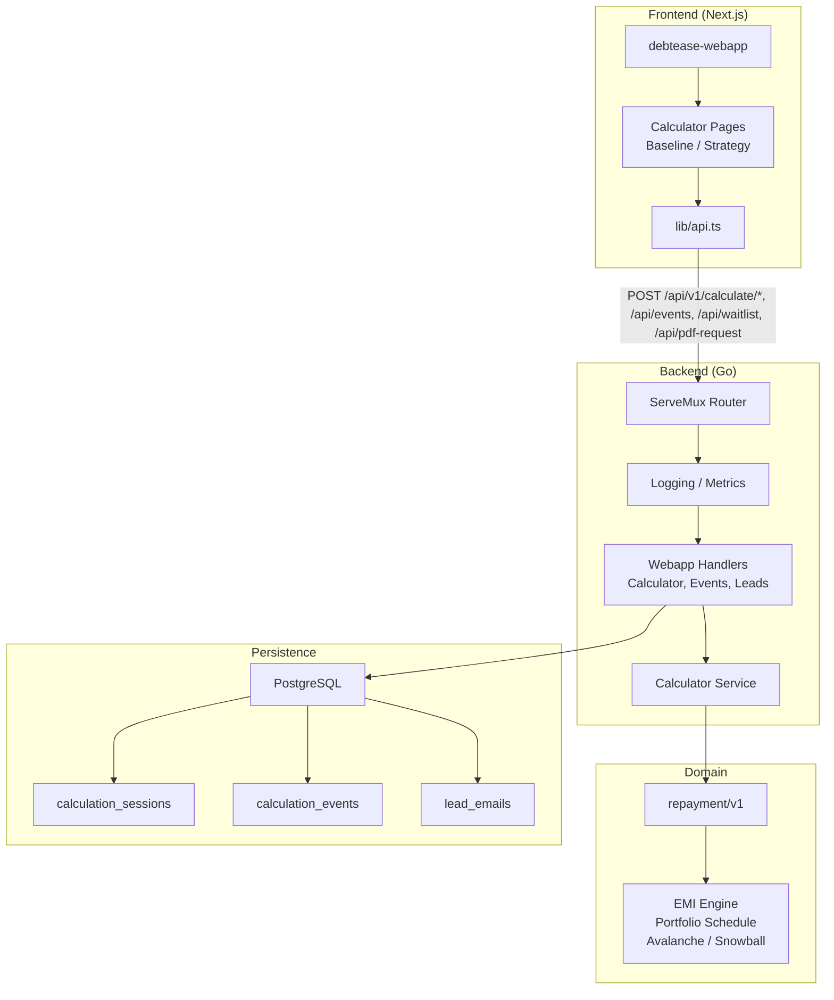
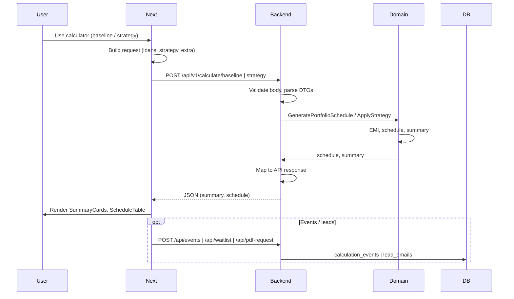
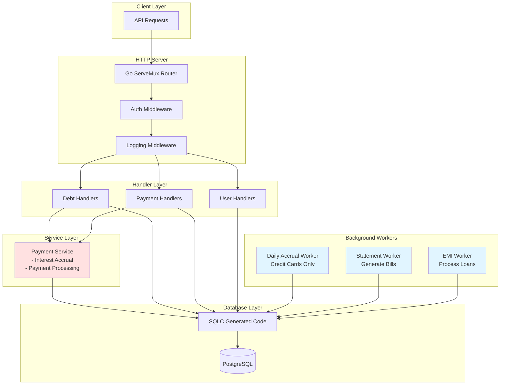
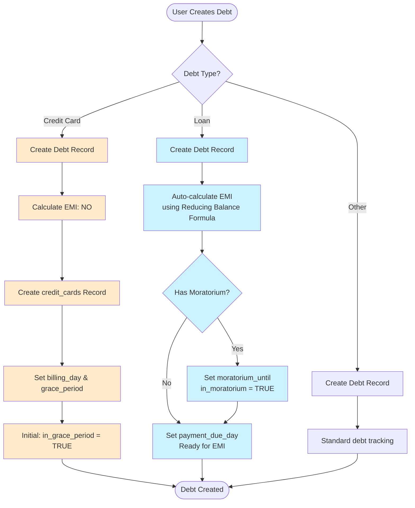
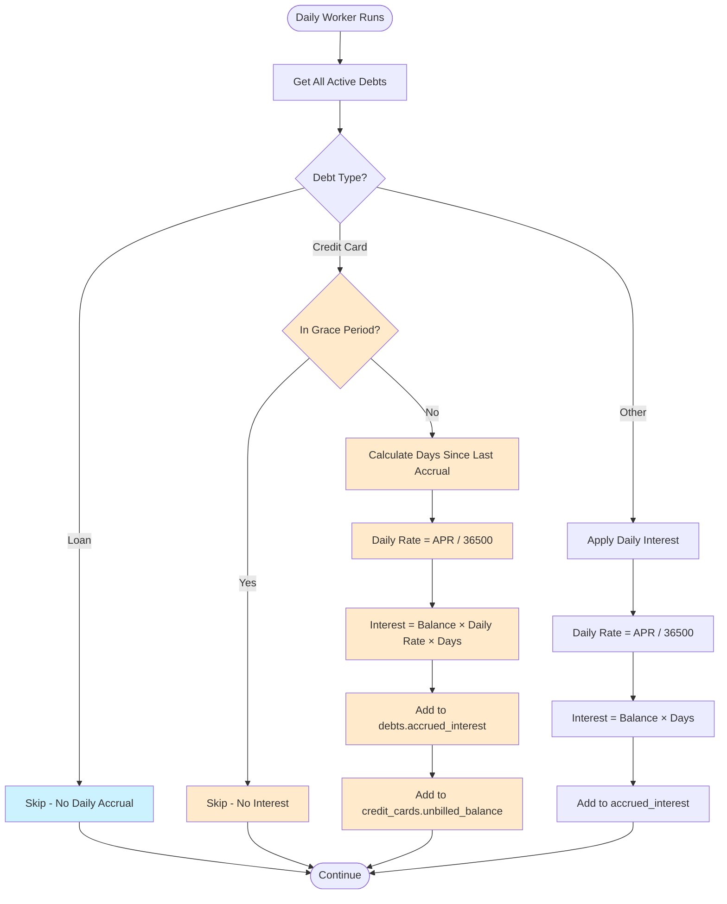
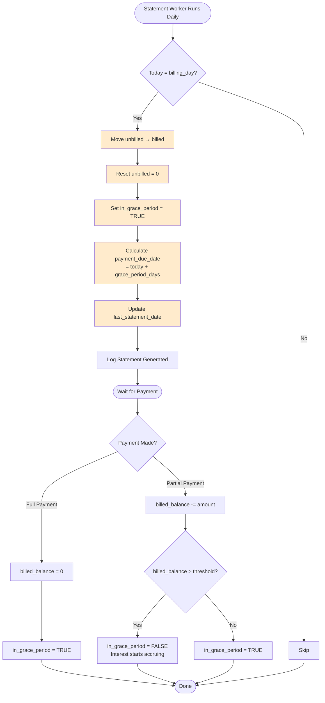
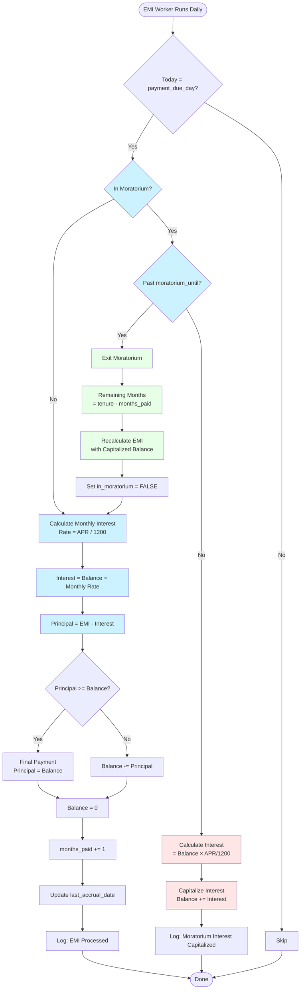
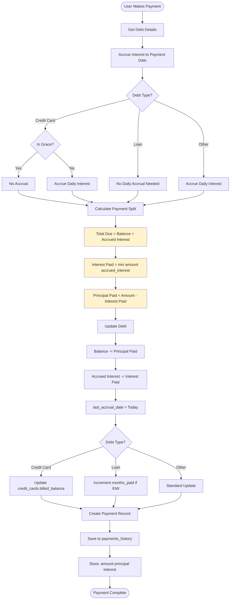
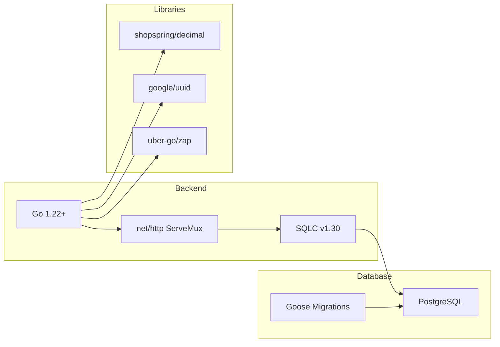

# DebtEase Backend - High Level Architecture

## Webapp Implementation Architecture (High Level)

This section describes the **full-stack webapp**: domain logic, Go backend, and Next.js frontend. The webapp offers **standalone calculators** (baseline + strategy) for debt payoff, with no auth required. It is distinct from the **app API** (debts, payments, dashboard, workers), which is documented in the rest of this file.

### System Overview: Domain, Backend, Frontend



### Domain Layer

The **repayment domain** (`internal/domain/repayment/v1`) is a **pure, finance-focused** engine. It owns EMI math, schedule generation, and strategy application. No HTTP, no DB.

| Concept | Description |
|--------|-------------|
| **Loan** | `Principal`, `AnnualRate`, `TenureMonths`, `MoratoriumMonths` |
| **EMIRecord** | Per-month: `OpeningBalance`, `EMI`, `Interest`, `Principal`, `ClosingBalance` |
| **PortfolioSummary** | `Months`, `TotalPaid`, `TotalInterest`, `TotalPrincipal` |
| **StrategyType** | `BASELINE`, `AVALANCHE`, `SNOWBALL` |

**Key functions:**

- `CalculateEMI(principal, annualRate, tenureMonths)` — reducing-balance formula.
- `GenerateLoanSchedule(loan)` — month-by-month schedule per loan (moratorium → repayment).
- `GeneratePortfolioSchedule(loans)` — combined portfolio schedule.
- `SummarizePortfolio(schedule)` — totals and debt-free month.
- `ApplyStrategy(loans, strategy, monthlyExtra)` — Avalanche or Snowball with extra payments.

Engine version is fixed (`EngineVersion`). See `docs/loan_engine.md` for formulae and behaviour.

### Backend (Go)

**Entrypoint:** `cmd/main.go` — `net/http` ServeMux, middleware (logging, metrics), then route handlers.

**Webapp-specific surface (no auth):**

| Route | Handler | Purpose |
|-------|---------|---------|
| `POST /api/v1/calculate/baseline` | `HandleBaselineCalculate` | Portfolio baseline (EMI-only) schedule + summary |
| `POST /api/v1/calculate/strategy` | `HandleStrategyCalculate` | Avalanche/Snowball + extra payment vs baseline |
| `POST /api/events` | `HandleCreateEvent` | Analytics events (e.g. `input_modified_after_result`) |
| `POST /api/pdf-request` | `HandlePdfRequest` | Request PDF plan; stores lead |
| `POST /api/waitlist` | `HandleWaitlist` | Waitlist signup; stores lead |

**Flow:** Handler → **Calculator Service** (`internal/webapp_specifics/service/calculator.go`) → **Domain** (`repayment/v1`). Service maps API DTOs ↔ domain types, then returns JSON.

**Persistence (webapp):** SQLC + PostgreSQL. Tables:

- **calculation_sessions** — `session_id`, `engine_version` (session lifecycle).
- **calculation_events** — `session_id`, `event_type`, `metadata` (JSONB) for analytics.
- **calculation_session_metrics** — aggregated signals (runs, strategy switches, input changes, PDF/waitlist).
- **lead_emails** — `email`, `source` (`waitlist` \| `pdf`), optional `session_id`.

App API (debts, payments, dashboard, auth, workers) is implemented but currently **disabled** in `main.go` (commented out). When enabled, those use separate handlers, middleware (e.g. auth), and DB tables (e.g. `debts`, `payments_history`).

### Frontend (Next.js)

**Stack:** Next.js 16, React 19, Tailwind CSS 4. App router, no auth.

**Structure:**

```
debtease-webapp/
├── src/
│   ├── app/
│   │   ├── (marketing)/          # Marketing + calculators
│   │   │   ├── page.tsx          # Landing
│   │   │   ├── blog/
│   │   │   └── calculator/       # Calculator hub
│   │   │       ├── page.tsx      # Baseline vs Strategy links
│   │   │       ├── baseline/     # Baseline calculator
│   │   │       └── strategy/     # Strategy calculator
│   │   └── layout.tsx
│   ├── components/ui/            # Button, Card, Container, Footer, Navbar
│   ├── features/calculator/      # LoanListEditor, ScheduleTable, SummaryCards, PdfModal
│   ├── hooks/                    # e.g. useSessionID
│   └── lib/
│       ├── api.ts                # API client (calculate, events, waitlist, pdf)
│       └── blog.ts
```

**API client (`lib/api.ts`):** `fetch` wrapper with `credentials: "include"`. Calls:

- `calculateBaseline`, `calculateStrategy` → `/api/v1/calculate/baseline`, `/api/v1/calculate/strategy`
- `createEvent` → `/api/events`
- `submitWaitlistEmail` → `/api/waitlist`
- `requestPdf` → `/api/pdf-request`

**Next.js rewrites:** `/api/*` and `/api/v1/*` are proxied to `BACKEND_ORIGIN` (env, default `http://localhost:8080`). The webapp and Go server can run separately; frontend talks to backend via this proxy.

**Calculators:** Two **independent** flows:

1. **Baseline** — Add/edit loans → POST baseline → show summary + schedule table. Optional events when user changes inputs after a result.
2. **Strategy** — Same loan inputs + strategy (Avalanche/Snowball) + monthly extra → POST strategy → show baseline vs strategy, delta (interest/months saved), schedule. Optional PDF request and waitlist.

### Request Flow (Calculator)



### Webapp vs App API

| Aspect | Webapp | App API |
|--------|--------|---------|
| **Auth** | None | JWT (login, refresh) |
| **Domain** | `repayment/v1` (calculators) | Payments, accrual, statements, EMI workers |
| **Storage** | Sessions, events, leads | Users, debts, credit_cards, payments_history |
| **Clients** | Next.js webapp | Flutter app (future), other API clients |

The **domain** is shared only in the sense that both use rigorous finance logic; the **repayment** engine is used by the webapp calculators. The **app** backend uses its own services (e.g. payment service, workers) and schema.

### Technology Stack (Webapp)

| Layer | Technologies |
|-------|--------------|
| **Domain** | Go (`internal/domain/repayment/v1`), no external deps |
| **Backend** | Go 1.22+, `net/http` ServeMux, SQLC, PostgreSQL, Goose migrations |
| **Frontend** | Next.js 16, React 19, Tailwind CSS 4, TypeScript |
| **API contract** | JSON over HTTP; `lib/api.ts` types align with backend DTOs |

---

## System Overview



## Debt Processing Flow



## Interest Accrual Logic



## Credit Card Statement Generation



## Loan EMI Processing



## Payment Processing Flow



## Worker Schedule

```mermaid
gantt
    title Daily Background Workers Schedule
    dateFormat HH:mm
    axisFormat %H:%M
    
    section Workers
    Daily Accrual (Credit Cards)    :active, w1, 00:00, 24h
    Statement Generation (Credit Cards) :active, w2, 00:00, 24h
    EMI Processing (Loans)          :active, w3, 00:00, 24h
    
    section Triggers
    Check billing_day match          :milestone, m1, 00:00, 0h
    Check payment_due_day match      :milestone, m2, 00:00, 0h
    Process credit cards out of grace :milestone, m3, 00:00, 0h
```



## Key Implementation Decisions

### 1. Interest Calculation Methods

| Debt Type | Method | Formula | Frequency |
|-----------|--------|---------|-----------|
| Credit Card | Daily (after grace) | APR / 36500 | Every day |
| Loan | Monthly | APR / 1200 | On due day |
| Other | Daily | APR / 36500 | Every day |

### 2. EMI Formula

**Reducing Balance Method:**
```
EMI = P × r × (1+r)^n / ((1+r)^n - 1)

Where:
P = Principal amount
r = Monthly interest rate (APR / 1200)
n = Number of months
```

### 3. Payment Priority

Payments are always split in this order:
1. **Interest First** - Pay off accrued interest
2. **Principal Second** - Remaining amount reduces principal

### 4. Credit Card Grace Period

```
Statement Date (billing_day)
         ↓
    [Grace Period]  ← No interest accrues
         ↓
Payment Due Date (billing_day + grace_period_days)
         ↓
   [Interest Accrual Starts]  ← If not paid in full
```

### 5. Moratorium Logic (Student Loans)

```
Loan Start
     ↓
[Moratorium Period]
  - Interest accrues monthly
  - Added to principal (capitalized)
  - No EMI payment required
     ↓
Moratorium End
     ↓
EMI Recalculated with:
  - New Principal = Original + Capitalized Interest
  - Remaining Tenure
     ↓
[Normal EMI Payments]
```

## Component Responsibilities

### Handlers Layer
- ✅ Validate API requests
- ✅ Create debts (credit cards + loans)
- ✅ Auto-calculate EMI for loans
- ✅ Record payments
- ✅ Return formatted responses

### Service Layer
- ✅ Interest accrual logic
- ✅ Route by debt type (credit card vs loan)
- ✅ Payment splitting (interest/principal)
- ✅ Transaction management

### Workers Layer
- ✅ **Daily Accrual Worker**: Credit cards out of grace
- ✅ **Statement Worker**: Generate monthly statements
- ✅ **EMI Worker**: Process loan payments & moratorium

### Database Layer
- ✅ SQLC type-safe queries
- ✅ Separate tables for credit cards
- ✅ Loan fields in debts table
- ✅ Payment history tracking

## Technology Stack



## API Endpoints

### Debt Management
- `POST /api/debts` - Create debt (credit card or loan)
- `GET /api/debts` - List user's debts
- `GET /api/debts/{id}` - Get debt details
- `PATCH /api/debts/{id}/balance` - Update balance
- `PATCH /api/debts/{id}/health` - Update health score
- `POST /api/debts/{id}/overdue` - Mark overdue

### Payment Management
- `POST /api/debts/{id}/payments` - Record payment
- `GET /api/debts/{id}/payments` - List payment history

### Authentication
- `POST /api/register` - Create user
- `POST /api/login` - Authenticate user
- `PUT /api/users` - Update user profile

## Performance Optimizations

1. **Indexes**:
   - `debts.user_id` - Fast user debt lookup
   - `debts.due_date` - Quick overdue checks
   - `debts.payment_due_day` - Efficient EMI scheduling
   - `credit_cards.payment_due_date` - Statement processing
   - `refresh_tokens.user_id` - Auth performance

2. **Worker Efficiency**:
   - Target specific records (out of grace, due today)
   - Batch processing where possible
   - Minimal database queries

3. **Type Safety**:
   - SQLC generates Go structs
   - Compile-time SQL validation
   - No ORM overhead

## Future Enhancements

- [ ] Payment reminders (email/SMS)
- [ ] Debt payoff strategies (avalanche/snowball)
- [ ] Auto-payment scheduling
- [ ] Credit score tracking
- [ ] Budget recommendations
- [ ] Debt consolidation suggestions
- [ ] Mobile app integration
- [ ] Analytics dashboard

